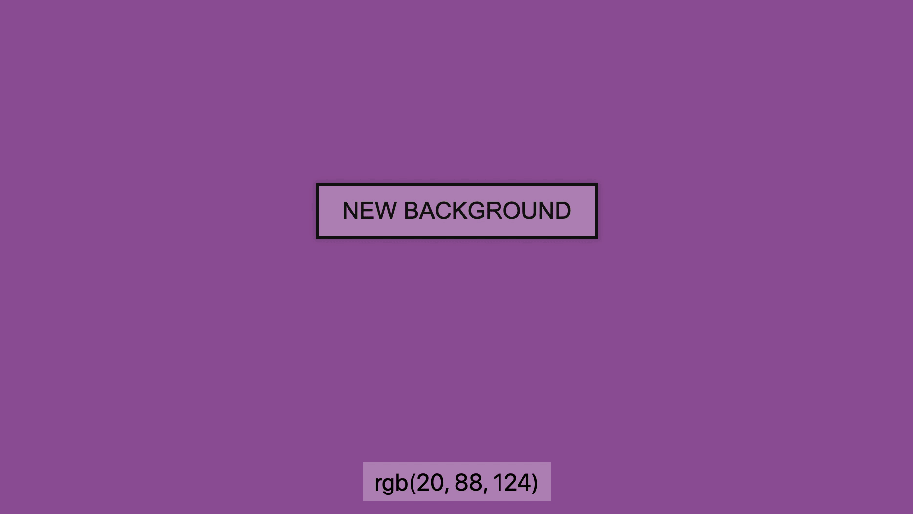

# Colour Randomizer

## Setup
- Fork this repository by clicking the "Fork" button in the top-right corner
- Clone the new repository to your local machine using Git

## Steps
1. Complete the steps in the HTML document to build a prototype interface for the colour randomizer
2. Built a colour string using `getRandomColorChannel()` for each of the three colour channels (R, G, B)
3. Update user interface (`document`), setting the new colour to the body's background
4. Use the new RGB value to update the label "rgb(###, ####, ###)" (replacing ###s with the Number values)
5. Wrap the random colour procedure in a function named `setNewColour()`, call it from the `console` to test

## Example

## Tips
- Before starting, consider using the browser's developer tools to prototype a solution manually
	- Start by changing the `<body>` background from the "Elements" tab by changing the `style=""` attribute
- Next, consider prototyping within JS by assigning three variables, each with a different Number value: 0-255
	- This will assist by creating a controlled case before assigning a random value
- Use the console to test each line of code that affects the document, as you code
	- Mis-selecting elements will create errors that prevent the page from working as intended
